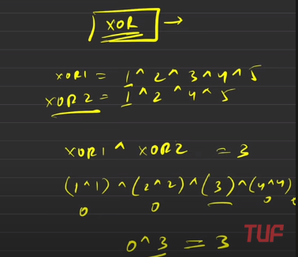
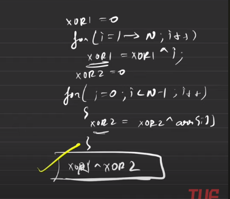

Arrays and questions

<<<<<<< HEAD

# Arrays in c++

```cpp
int arr[n]={2};
// gives an array of size n with all values as 2
```

when value
## 
# 1. Find Second largest element in an array
##  $$Brute :O(n^2logn)$$
1. ### Sort the array - O (n logn)
1. ### From back, the elemetn smaller than - O(n)

##  $$Better:O(2n)$$
1. ### In linear search, get largest
1. ### In linear search , get second largest

## $$Optimal solution:O(n) $$
1. ### In same linear search have both variables
1. ### update when we get a number larger than large becomes that and second largest becomes largest

# Tip: to stand out in interview, write proper interger names

## Q. Missing number problem: [Leetcode Easy](https://leetcode.com/problems/missing-number/description/)
> - eg: {1,2,4,5,6}... output should be 3 suice it is missing 

### Soln 1: Find sum of the array
> $$Time:O(n),Space:O(1)$$
> 1. Find sum of the array and sum of 1 to len-1  
> 2. The difference is the answer
> Can have problem storing the sum if the array is too long
### Soln 2: XOR method
  
- When you XOR a number with itself gives zero
- OR with all those XOR will give give 0 give  




[](This_is_a_comment)


<h1 style="color:orange;font-size:2.5rem;"> Longest Sub-Array with sum K		</h1>

> ### Similar leetcode quesion: [Leetcode 560 medium](https://leetcode.com/problems/subarray-sum-equals-k/)  
> </br>


<!--////////////////////////////////////////////////////////////-->
<h1 style="color:orange;font-size:2.5rem;"> 2Sum Problem		</h1>
<!--////////////////////////////////////////////////////////////-->
<h1 style="color:orange;font-size:2.5rem;"> Sort an array of 0's 1's and 2's		</h1>

<!--////////////////////////////////////////////////////////////-->
<h1 style="color:orange;font-size:2.5rem;"> Majority Element (>n/2 times)		</h1>


<!--////////////////////////////////////////////////////////////-->
<h1 style="color:orange;font-size:2.5rem;"> Kadane's Algorithm, maximum subarra…		</h1>

<!--////////////////////////////////////////////////////////////-->
<h1 style="color:orange;font-size:2.5rem;"> Print subarray with maximum subarra…	</h1>
<!--////////////////////////////////////////////////////////////-->
<h1 style="color:orange;font-size:2.5rem;"> Stock Buy and Sell		</h1>
<!--////////////////////////////////////////////////////////////-->
<h1 style="color:orange;font-size:2.5rem;"> Rearrange the array in alternating …		</h1>
<!--////////////////////////////////////////////////////////////-->
<h1 style="color:orange;font-size:2.5rem;"> Next Permutation		</h1>
<!--////////////////////////////////////////////////////////////-->
<h1 style="color:orange;font-size:2.5rem;"> Leaders in an Array problem		</h1>

<!--////////////////////////////////////////////////////////////-->
<h1 style="color:orange;font-size:2.5rem;"> Longest Consecutive Sequence in an …		</h1>
<!--////////////////////////////////////////////////////////////-->
<h1 style="color:orange;font-size:2.5rem;"> Set Matrix Zeros		</h1>
<!--////////////////////////////////////////////////////////////-->
<h1 style="color:orange;font-size:2.5rem;"> Rotate Matrix by 90 degrees		</h1>

<!--////////////////////////////////////////////////////////////-->
<h1 style="color:orange;font-size:2.5rem;"> Print the matrix in spiral manner		</h1>
<h1 style="color:orange;font-size:2.5rem;"> Count subarrays with given sum    </h1>