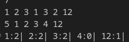

# Hashing:

- ### ***'Prestoring and fetching'*** 
- ### Max size of an array inside main can be 10^6 and max size of an array in global array in 10^7.

### [hashing1.cpp](./hashing1.cpp)
```cpp
int main()
{
    int t;cin>>t;
    int arr[t];
    int hasharr[1000000]={0};
    
    while(t--){
       cin>>arr[t];
       hasharr[arr[t]]++;
    }
    for(int i=0;i<1000000;i++){
        if(hasharr[i]>0){
            cout<<i<<": "<<hasharr[i]<<endl;
        }
    }
    return 0;
}
```


## Character hashing:

### [Alphabet Hashing](hashing2.cpp)
   

## Character Hashing:

### - There are only 256 charecters so , hasing array can only be of size 256.

### - Hence it has no limitations

### ***Number hasing issue- At max we can do it is 10^7.***

## Map and unordered map:

- ### imagine you are given an arr 1,2,3,1,3,2
- ### map< int key, int value>
- ### value is how many times a key appears

### [Maps CPP code](./Code/maps1.cpp)  
  
  

- ### Map keeps all values in sorted form 
- ###  Storing or fetching takes O(Log(n)) for all cases:best/worst/avg

## Unordered Map

|       | Storing | Fetching |
|-------|---------|----------|
| Best  | O(1)    | O(1)     |
| Worst | O(n)    | O(n)     |
| Avg   | O(1)    | O(1)     |

- ### Worst case happens due to internal collisions
- ### Almost always ***prefer unordered maps*** over normal maps(ordered)
