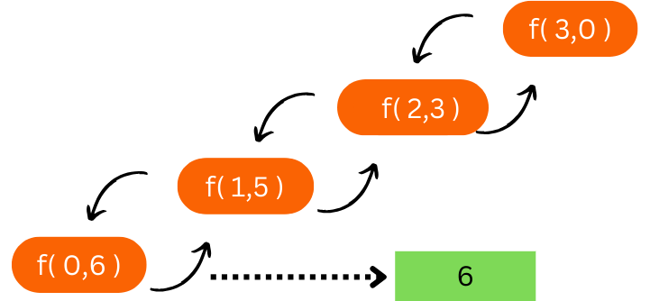
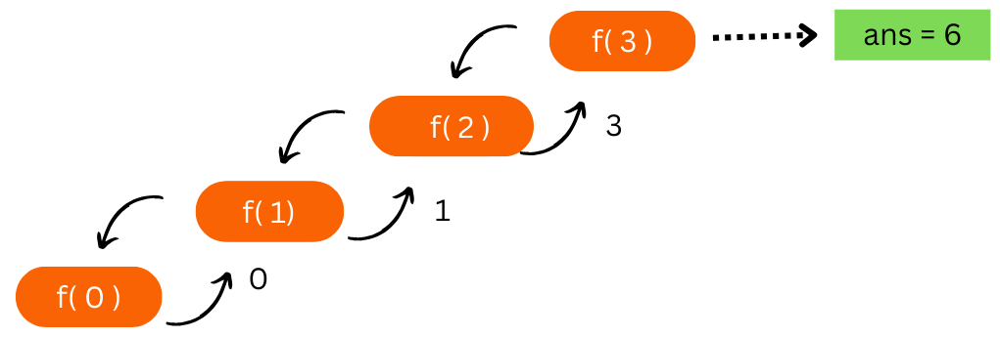

# Re:🔄 Recursion series
## Re 1: Intro to recursion 🌀
A recursion MUST have a **'Base case'** to stop the recursion finitely.(Else segmentation fault/ stack overflow)

Always try to visualize recursion by **recursion tree or call stack**
## Re 2: Basic recursion problems
### 1. print name 5 times
```
void f(i,n) ...... O(n)
    if(i>n)
        return ;  //base case
    print("Meow");
    f(i+1);    //recursive call

main : call f(0,n)
```


### 2. print linearly from 1 to n

```
void f(i,n) ...... O(n)
    if(i>n)
        return ;  //base case
    print(i);
    f(i+1);    //recursive call

main : call f(0,n)
```
### 3. print from n to 1
```
void f(i,n) ...... O(n)
    if(i<1>)
        return ;  //base case
    print(i);
    f(i-1);       //recursive call

main : call f(n,n)
```
### 4. print linearly 1 to n by ***Backtracking***
- Intro to ***Backtracking***
- *What if we write print after recursive call ?*

~~~
f(i,n){
    if(i<1)
        return;
    f(i-1,N);
    print(i);
}

main : call f(n,n)
~~~

### 5. print from n to 1 by Backtracking
```
similar code
```
---

## Re3: Paramerized and fucntional recursion:

## 1. Sum of first N numbers

### a. Parameterized method: 
- index and answer in the parameter of func

- **Pattern:** when the function needs to **return** something
```
// parameterized method


f(i,sum){
    if(i<1){       //base case
        print sum
        return;
    }
    f(i-1,sum+i)   //added the sum and passed it to the next call
}

main : call f(n,0)
```



### b. Functional method:
 **Pattern:** when the function needs to **return** something

```
//Functional method

f(n){
    if(i==0){       //base case
        return 0;
    }
    return n + f(n-1) ;
    //added the sum and passed it to the next call
}

main : ans=f(n);
```


---

## 2. Factorial

```
//Functional method

f(n){
    if(n==0){
        return 1;
    }
    return n*f(n-1);
}
```
---


## Re4: Problems on functional Recursion

### Q1. Find the reverse of an array
- method:  recursion using 2 pointers

```
f(l,r){
    if(l<r) return;

    swap( a[l],a[r] );
    f(l+1,r-1);
}
```

~~~
f(i){
    if(i>=n/2) return;

    swap(a[i],a[n-i-1]);
    f(i+1);
}
~~~

### Q4 Palindrome check

~~~
f(i){
    if(i>=n/2) 
        return true;   // base case

    if(a[i]!=a[n-i-1];)
        return false;
    
    return f(i+1);
}
~~~

## Re.5 : Multiple Recursive calls

### Fibonacii:
```
f(n){
    if(n<=1){
        return n;
    }
    return f(n-1)+ f(n-2) ;
}
```


