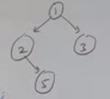

# L1 Intro to Binary Trees

> Feb 10 2024

## Types of BT:
1. Full BT
    - Every node will either have 0 or 2 children
2. Complete
    - All levels are completely filled (except last)
    - The last level should have all data as left as possible
3. Perfect BT
    - All leaf nodes are at the same level
4. Balanced BT
    - Height of a node dcan be max Log(N)
5. Degenerate BT
    - Aka skewed 

# L2 BT representation in C++
> Feb 10 2024


```cpp
struct Node{
    int data;
    int struct Node* left, right;
}

Node(int val){

    data = val;
    left=right=NULL;

}
```
```cpp
int main(){
    struct Node *root = new Node(1);
    root->left=new Node(2);
    root->right = new Node(3);
    root->left->right = new Node(5);
}
```

# L3 Java BT
# L4 BT traversal methods

### Traversal techiniques:  

> 23 Feb '24

    1. DFS: Depth First Search
        1. Inorder Traversal
            ```
            left
            root
            right
            
            ```
        2. Preorder
        ```
            root
            left
            right
            
            ```
        3. Post order
    2. BFS: Breadth First Search
        1.Level Order Traversal


# L5 Preorder Traversal of a BT

> 23 Feb '24

$$TC:O(N)$$

```cpp
void preorder(node){
    if(node==NULL){
        return;
    }
    print(node->data);
    preorder(node->left);
    preorder(node->right);
}
```

# L6 Inorder Traversal of a BT

> 23 Feb '24

$$TC:O(N)$$

```cpp
void inorder(node){
    if(node==NULL){
        return;
    }
    inorder(node->left);
    print(node->data);
    inorder(node->right);
}
```

# L7 Postorder Traversal of a BT

> 23 Feb '24

$$TC:O(N)$$

```cpp
void inorder(node){
    if(node==NULL){
        return;
    }
    inorder(node->left);
    inorder(node->right);
    print(node->data);
}
```
# L8 Levelorder Traversal of a BT

> 23 Feb '24

Pseudocode(using stack/queue):
1. levelorder(node)
    1. Push Root into stack
    1. while(stack!=NULL)
        1. for(int i=0 to stack.size())
            1. declare array curr_level[stack.size()]
            1. newnode = stack.top()
            2. stack.pop()
            3. call levelorder(node->left)
            4. call levelorder(node->right)
            5. curr_level.add(node->val)
        2. print curr level / push curr_level to array of arrays
    2. return
            
## Cpp code to get vector of vectors of each levels using stack:

> for loop inside while loop implementation
```cpp
// Posted in my Leetcode
vector<vector<int>> levelOrder(TreeNode* root) {
    vector<vector<int>> ans;

    if(root==NULL)// null tree check
        return ans;

    queue <TreeNode*> q;

    q.push(root);

    while (!q.empty()){
        vector<int> level;

        int n = q.size();// IMP: gets the number of values for that level

        for(int i=0;i<n;i++){
            TreeNode* temp = q.front();
            q.pop();
            level.push_back(temp->val);// added to current level

            if(temp->left != NULL)
                q.push(temp->left);
            if(temp->right != NULL)
                q.push(temp->right);
        }
        
        ans.push_back(level);
        
    }

    return ans;
}
```


# L9 Iterative Preorder Traversal of a BT

> 23 Feb '24


## Implementation using stack:
### Psuedocode:

### 🚨🚨 NOTE: Right then Left (to get Left to right)!!!!!!

```py
Push root to stack

while(stack not empty)
    root = stack.top()
    stack.pop()

    print / add node->data to array

    if(left exists)
        stack.push(left)
    if(right exists)
        stack.push(right)
```

```cpp
vector < int > preOrderTrav(node * curr) {
    vector < int > preOrder;
    if (curr == NULL)
        return preOrder;

    stack < node * > s;
    s.push(curr);

    while (!s.empty()) {
        node * topNode = s.top();
        preOrder.push_back(topNode -> data);
        s.pop();
        if (topNode -> right != NULL)
            s.push(topNode -> right);
        if (topNode -> left != NULL)
            s.push(topNode -> left);
    }
    return preOrder;

}
```

# L10 Iterative Inorder Traversal of a BT

> 23 Feb '24


```cpp
vector < int > inOrderTrav(node * curr) {
    vector < int > inOrder;
    stack < node * > s;

    while (true) {
        if (curr != NULL) {
            s.push(curr);
            curr = curr -> left;
        } 
        else{
            if (s.empty()) 
                break;
            curr = s.top();
            inOrder.push_back(curr -> data);
            s.pop();
            curr = curr -> right;
        }
    }
    return inOrder;
}
```


# L11 Iterative Postorder Traversal of a BT

## Implementation using 2 stacks:
### Psuedocode:


# L12
# L13
# L14
# L15
# L16
# L17
# L18
# L19
# L20
# L21
# L22
# L23
# L24
# L25
# L26
# L27
# L28
# L29
# L30
# L31
# L32
# L33
# L34
# L35
# L36
# L37
# L38
# L39
# L40
# L41
# L42
# L43
# L44
# L45
# L46
# L47
# L48
# L49
# L50
# L51
# L52
# L53
